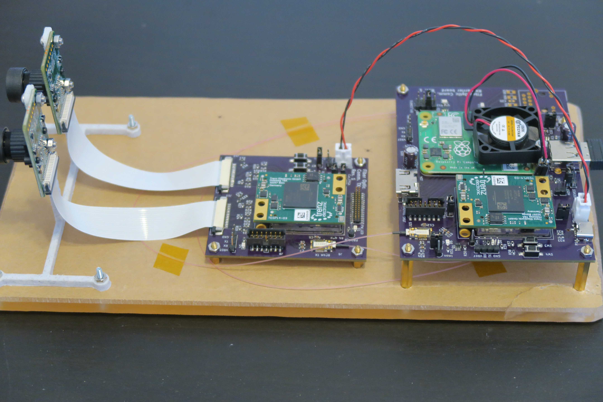
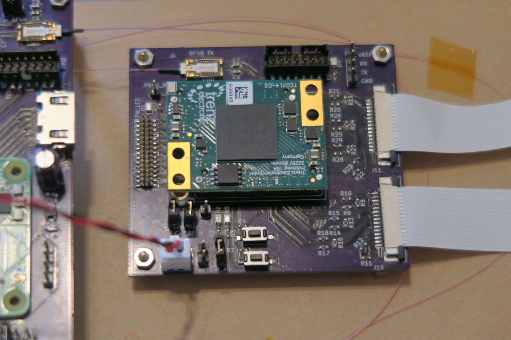
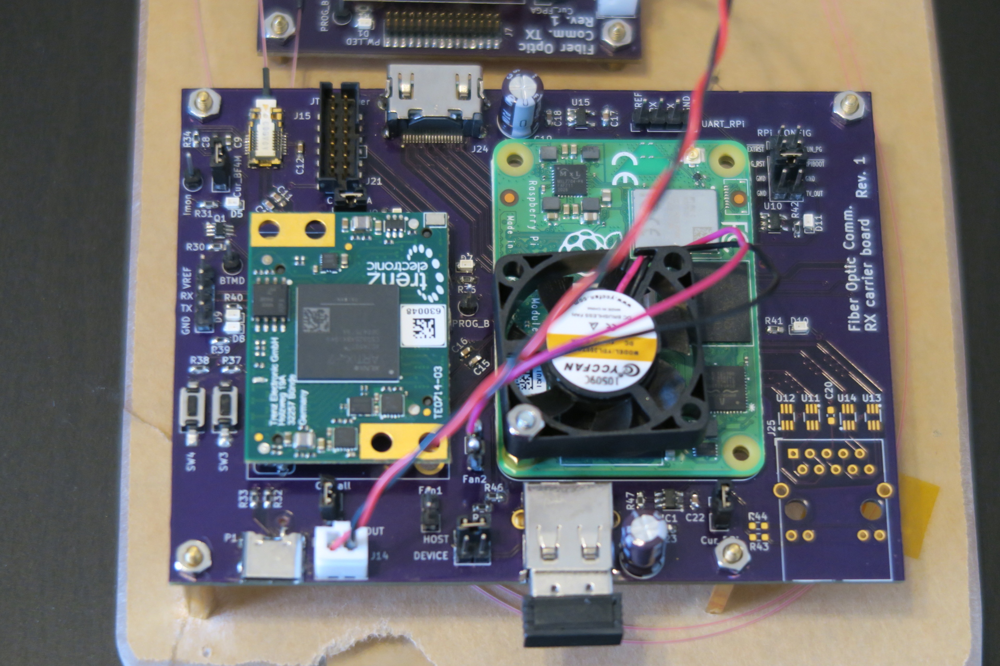

# Dual Imaging

## Introduction

## Demonstration Video

https://user-images.githubusercontent.com/22487346/164984304-3e48e70a-c83b-4c12-9497-3e3b185fa539.mov

## Hardware
* Artix-7 FPGA module from Trenz Electronic: [TE0714-03-50-2IAC6](https://shop.trenz-electronic.de/en/TE0714-03-50-2IAC6-FPGA-Module-with-Xilinx-Artix-7-XC7A50T-2CSG325I-1.8V-Configuration-4-x-3-cm)

* Raspberry Pi Compute Module 4

* BF4M fiber-optic module

* Pcam5C

## System Architecture

## Images of the Prototype

