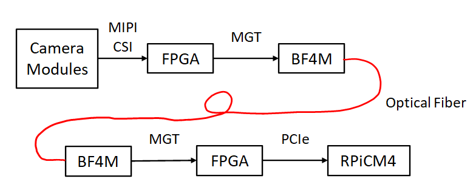

# Dual-Imaging Display
This prototype is developed in partial fulfillment for a Master's degree to prove that fiber-optic interconnection is a suitable high-speed interconnection for CubeSat platforms. The thesis is available [here](https://gatech.edu).

## Introduction
This repository contains the development details of dual-imaging display using the BF4M fiber-optic module with FPGAs and Raspberry Pi Compute Module 4. The goal of this prototype is to demonstrate the high-speed interconnection using a fiber-optic transceiver for CubeSat platforms.

## Hardware
* Artix-7 FPGA module from Trenz Electronic: [TE0714-03-50-2IAC6](https://shop.trenz-electronic.de/en/TE0714-03-50-2IAC6-FPGA-Module-with-Xilinx-Artix-7-XC7A50T-2CSG325I-1.8V-Configuration-4-x-3-cm)

* [Raspberry Pi Compute Module 4](https://www.raspberrypi.com/products/compute-module-4)

* [BF4M](https://www.hirose.com/product/series/BF4M) fiber-optic module from Hirose Electronic

* [Pcam 5C](https://digilent.com/shop/pcam-5c-5-mp-fixed-focus-color-camera-module) camera module from Digilent

## System Architecture
Below shows the overview of the dual-imaging display system.

MIPI CSI-2 Rx Subsystem IP core is used for interfacing with the camera modules, and Aurora8B10B Ip core for interfacing with the fiber-optic transceiver operating up to 6.25 Gbps. On the receiver FPGA, DMA/Bridge Subsystem for PCI Express IP core is used for interfacing with the Raspberry Pi Compute Module 4 over PCIe.

Post-synthesis re-routing on the RX FPGA is needed for GTP clock signals as Aurora8B10B and PCIe core require different clock source. The details are explained in **Vivado/README.md**.

## Images of the Prototype

## Demonstration Video
Below video demonstrates that the two camera data stream are transmitted to the Raspberry Pi Compute Module 4 at 1.0 Gbps. The RPiCM4 was capable of receiving the data stream to /dev/null at 2.0 Gbps, but the maximum data rate to write the data stream to its RAM was 1.0 Gbps.

https://user-images.githubusercontent.com/22487346/164984304-3e48e70a-c83b-4c12-9497-3e3b185fa539.mov

The validation method discussed in the thesis demonstrated that the BF4M fiber-optic module achieved the maximum data rate of 6.25 Gbps at the power consumption of 90 mW.
