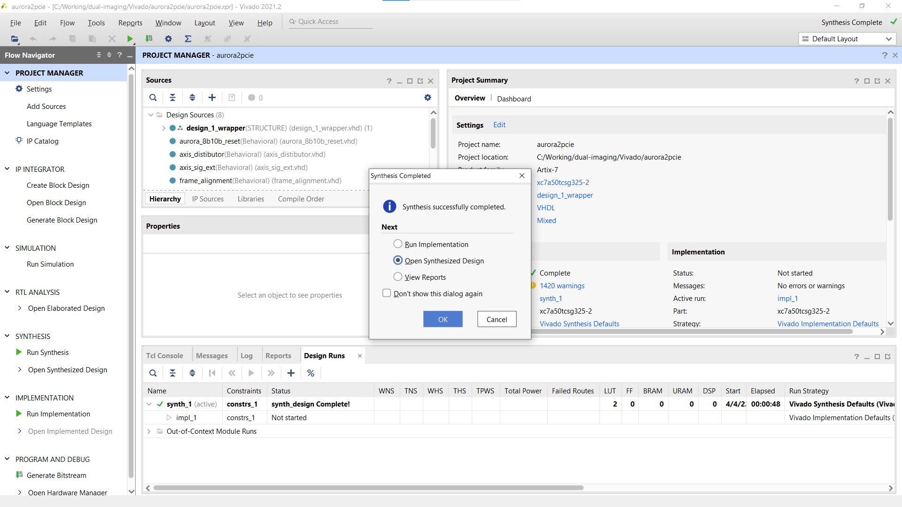
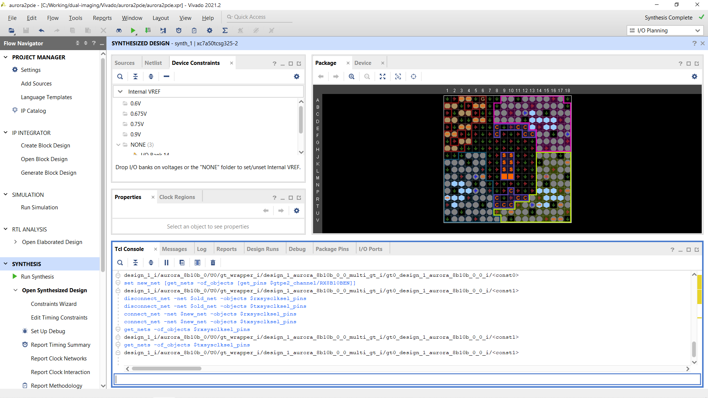
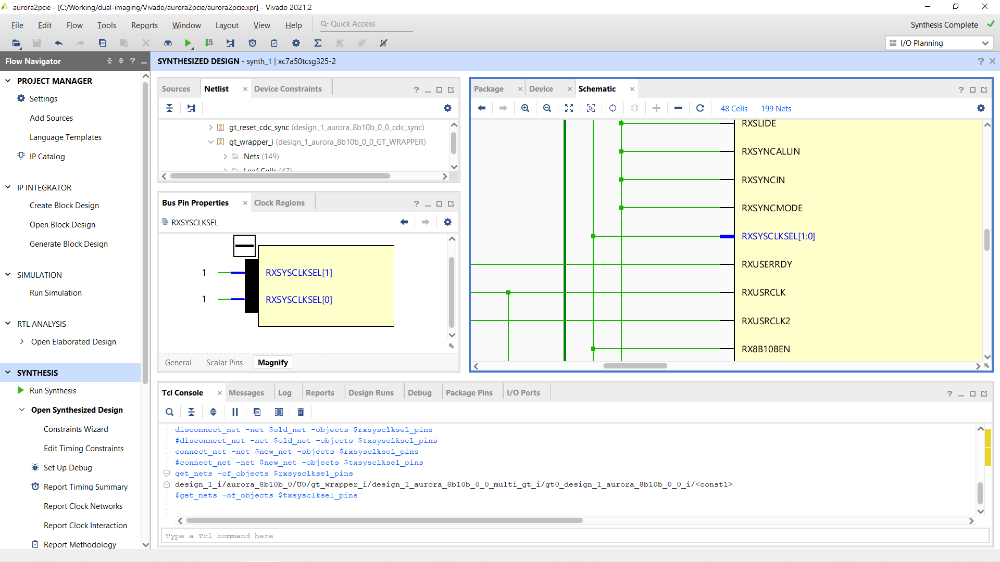

# Vivado Development

Software: Vivado 2021.2

Run create_project_mipiCsi2aurora.bat to build a Vivado project for the TX board (Windows only). This batch file runs create_project_mipiCsi2aurora.tcl script. Similarly, run create_project_aurora2pcie.bat to build a Vivado project for the RX board. Running the project creation tcl scripts for other version of Vivado may produce error upon execution. Modify the tcl scripts accordingly by replacing the version number with the appropriate one.

Successful execution of the script will launch the Vivado project looking similar to the below.

create_BD_[mipiCsi2aurora/aurora2pcie].tcl are available for those who want to just create the block design. Overviews of the block design for TX/RX board are available under ../Docs directory.

## Directories

* bitstream
    - bitstream files for the TX/RX board generated by Vivado

* hardwareDesign
    - FPGA hardware binary for the TX board exported from Vivado

* memoryConfig
    - memory contents for flash memory on the TE0714 module

* my_constrs/my_rtl/my_tcl
    - source files used in the projects, mipiCsi2aurora and aurora2pcie

## aurora2pcie Project Guide

The Aurora8B10B and PCIe core uses PLL0 by default. Since they require different clock frequency, one of them must use PLL1. This conflict is addressed by running tcl command after synthesis.

After completing the synthesis, open synthesized design as shown below.

This will open the Synthesized Design window. Run my_tcl/aurora_pll1.tcl or copy and paste the content of my_tcl/aurora_pll1.tcl in Tcl Console to make the aurora8B10B IP core on the RX board to use PLL1 instead of PLL0.

Successful execution of the tcl commands should re-route the RXSYSCLKSEL of the GTPE2_CHANNEL primitive to b'11.

Then, continue to run Implementation while the Synthesized Design window opened. Since the synthesized designed is opened in-memory, the net change applied by the above tcl command is also in-memory. Closing the Synthesized Design window will lose the change, and Vivado will implement the design with the original design.
